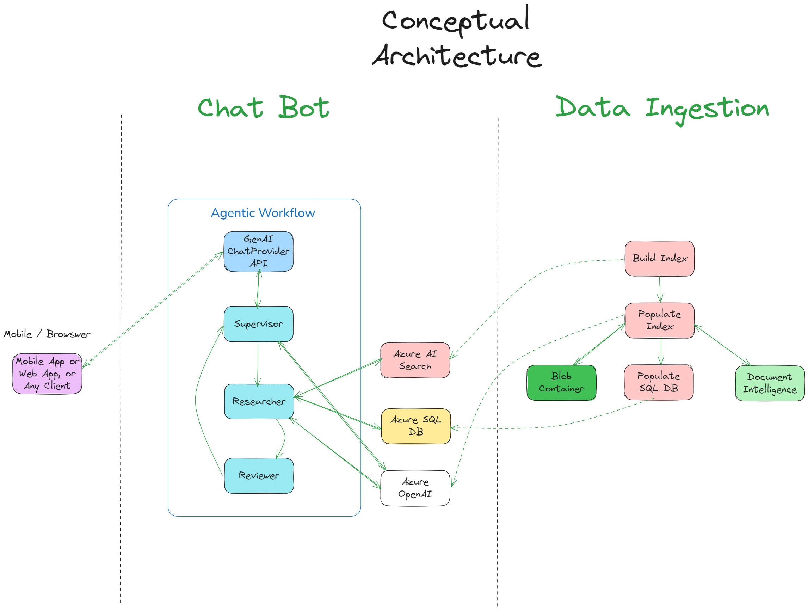

# Solution Architecture and Approach

## Conceptual Architecture
Below is a rendering of a conceptual architecture for this solution.



## Considerations
- Using a Hybrid approach, i.e. AI Search for embeddings and semantic searches and SQL for NL2SQL
- Considering that Addendums play an important role in fully understanding the agreement is very important
    - By creating a genaric schema in SQL that be be leveraged for any contract will provide a lot of flexibility
- All documents we would create embeddings for so users can perform NL searachs against the contracts
- But, for the situations in which there are Addendums it makes more sense so have those relation ships stored in SQL
    - We would have the general details stored in SQL (see details below) along with the relationships between contracts and addendums
    - Users would ask a question and we would first perform a SQL query to see if we can find any details, if found, we and perform a search to find the embeddings for the contract and any addendums

## Document Structure
Understanding the document structure for each document / vendor contract is extremly important.  There must be a clear way to identify how the contracts are related to any addendums, otherwise how can we establish a relationship between the two?

## AI Search Index Structure
We will need to make some decisions on the common fields that should be included in the index beyond just the contact and the embeddings for the content.  Below is an example of the fields we may need to consider for the index.

```
  document = {
                "id": document_id,
                "contractId": contract_id,
                "vendorName": vendor_name,
                "clientName": client_name,
                "contractTitle": contract_title,
                "effectiveDate": effective_date,
                "endDate": end_date,
                "signingDate": signing_date,
                "status" : status,
                "compensation": compensation,
                "paymentTerms": payment_terms,
                "currency": currency,
                "parentContractId": parent_contract_id,
                "amendmentNumber": amendment_number 
                "date": current_date,
                "sourceFileName": fileName,
                "searchVector": searchVector
            }
```

## SQL Schema Example
The schema below is a generic schema that should be usable for any contract type.  The purpose of this schema is to store contract details that should be generic to all contracts and amendments.  If can also be used to store amendments and the amendments would be related to the parent contract, which allows us to search for contract and amendments that are related.  For those contracts that have uncommon data, we can store that in the Metadata column which allows us to capture additional data without having to add a lot of columns that will not be common across contracts.

We are adding comments as these will be used to create the column descriptions.

```
CREATE TABLE dbo.Contracts
(
    ContractID INT PRIMARY KEY,
    VendorName NVARCHAR(255),
    ClientName NVARCHAR(255),
    ContractTitle NVARCHAR(255),
    ContractType NVARCHAR(100),
    EffectiveDate DATE,
    EndDate DATE,
    SigningDate DATE,
    Status NVARCHAR(50),
    Compensation DECIMAL(18, 2),
    PaymentTerms NVARCHAR(100),
    Currency NVARCHAR(10),
    ScopeOfWork NVARCHAR(MAX),
    GoverningLaw NVARCHAR(255),
    TerminationClause NVARCHAR(MAX),
    ConfidentialityClause BIT,
    ParentContractID INT,
    AmendmentNumber INT,
    Notes NVARCHAR(MAX),
    Metadata NVARCHAR(MAX)
);
GO
```

### Column Descriptions

When leveraging NL2SQL it's very important to have column descriptions for the schema so when you dynamically extract the Schema from SQL, you alos have the descriptions for the columns, as this helps the LLM with generation of the SQL Query.

| **Column Name**         | **Description**                                                                 |
|--------------------------|--------------------------------------------------------------------------------|
| **ContractID**           | Unique identifier for each contract.                                           |
| **VendorName**           | Name of the vendor or contractor involved in the agreement.                    |
| **ClientName**           | Name of the client or contracting entity.                                      |
| **ContractTitle**        | A brief title describing the contract (e.g., "Service Agreement").             |
| **ContractType**         | The category or type of contract (e.g., NDA, SLA, Service Agreement).          |
| **EffectiveDate**        | The date when the contract becomes effective.                                  |
| **EndDate**              | The expiration or termination date of the contract, if applicable.             |
| **SigningDate**          | The date on which the contract was signed by all parties.                      |
| **Status**               | Current status of the contract (e.g., Active, Draft, Terminated).              |
| **Compensation**         | The total financial value of the contract.                                     |
| **PaymentTerms**         | Payment terms, including frequency or milestones (e.g., "Net 30 days").        |
| **Currency**             | The currency used in the financial details (e.g., USD, EUR).                   |
| **ScopeOfWork**          | A summary of the scope or deliverables defined in the contract.                |
| **GoverningLaw**         | The legal jurisdiction governing the contract.                                 |
| **TerminationClause**    | Key details about the termination conditions outlined in the contract.         |
| **ConfidentialityClause**| Indicates whether a confidentiality clause is included in the contract.        |
| **ParentContractID**     | The ID of the original contract if this is an amendment or addendum.           |
| **AmendmentNumber**      | The sequential number of the amendment or addendum to the contract.            |
| **Notes**                | Any additional notes or comments about the contract.                           |
| **Metadata**             | A JSON column to store unstructured or custom data extracted from the contract.|

### Add column descriptions to table
You can use the SQL Script in the Scripts->SQL folder to Add the Columns descriptions.  

[SQL Script to add column descriptions](./scripts/SQL/AddColumnDescriptions.sql)
